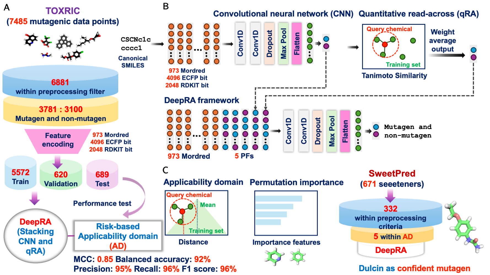

# DeepRA: A Novel Deep Learning-Read-Across Framework and Its Application in Non-Sugar Sweeteners Mutagenicity Prediction


Tarapong Srisongkram(tarasri@kku.ac.th)

Division of Pharmaceutical Chemistry, Faculty of Pharmaceutical Sciences, Khon Kaen University, 40002 

## This repository contains tutorial for using DeepRA
DeepRA model was trained to classifiy mutagenicity properties of chemicals.

Please find the full instruction in the [DeepRA_tutorial.ipynb](https://github.com/taraponglab/deepra/blob/main/DeepRA_tutorial.ipynb)

### How to use this software
It works best in Google colab via this link: [DeepRA_tutorial.ipynb](https://github.com/taraponglab/deepra/blob/main/DeepRA_tutorial.ipynb)

Before using this software, please change the data in this file: [dulcin.csv](dulcin.csv) with you prediction molecule.

#### Download necessary packages
```
!pip install rdkit
!pip install mordred
```
#### Clone this and updated this repository as needed
```
!git clone https://github.com/taraponglab/deepra.git
%cd deepra
!git fetch
!git pull
```

#### Check the file in your system
```
%ls
```
#### Download models
```
from joblib import load
scaler_mord = load('mordred_scaler.joblib')
model_mord  = load('CNN-Mordred.joblib')
model_rdkit = load('CNN-RDKIT.joblib')
model_ecfp  = load('CNN-ECFP.joblib')
model_ad    = load('AD_nn.joblib')
deepra      = load('DeepRA-Mordred.joblib')
```

#### Load test data (can change input via adjust dulcin file)
```
import pandas as pd
df = pd.read_csv('dulcin.csv', index_col = 'Name')
df
```
#### Then, run all the cells in the Google Colab
You will get this result from the last cell
```
Name    DeepRA-Mordred	class	AD_status			
dulcin	0.997393	    1	    within_AD
```
#### Interpretation
**DeepRA-Mordred** = Possibility of mutagenicity (if DeepRA-Mordred < 0.5 then it is non-mutagen, if > 0.5 then it is mutagen)

**class** = Mutagenicity class where 1 = mutagen and 0 = non-mutagen

**AD_status** = Prediction is within or outside AD


## Version
DeepRA version 1.0

Under peer review stages

## MIT Licence

Copyright (c) [2024] [Dr.Tarapong Srisongram]

Permission is hereby granted, free of charge, to any person obtaining a copy
of this software and associated documentation files (the "Software"), to deal
in the Software without restriction, including the rights to use, copy, modify,
merge, publish, distribute, sublicense, and/or sell copies of the Software,
and to permit persons to whom the Software is furnished to do so, subject to
the following conditions:

The above copyright notice and this permission notice shall be included in
all copies or substantial portions of the Software.

THE SOFTWARE IS PROVIDED "AS IS", WITHOUT WARRANTY OF ANY KIND, EXPRESS OR
IMPLIED, INCLUDING BUT NOT LIMITED TO THE WARRANTIES OF MERCHANTABILITY,
FITNESS FOR A PARTICULAR PURPOSE AND NONINFRINGEMENT. IN NO EVENT SHALL THE
AUTHORS OR COPYRIGHT HOLDERS BE LIABLE FOR ANY CLAIM, DAMAGES OR OTHER
LIABILITY, WHETHER IN AN ACTION OF CONTRACT, TORT OR OTHERWISE, ARISING FROM,
OUT OF OR IN CONNECTION WITH THE SOFTWARE OR THE USE OR OTHER DEALINGS IN THE
SOFTWARE.